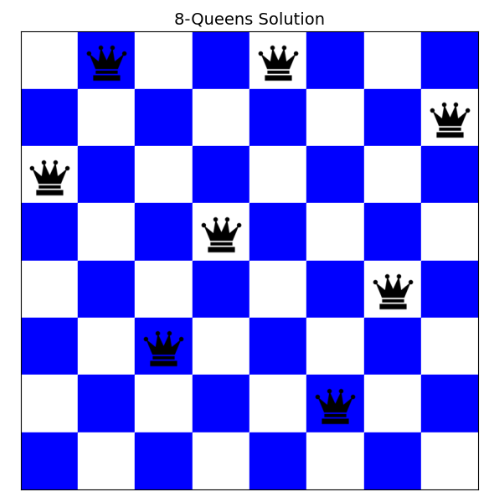
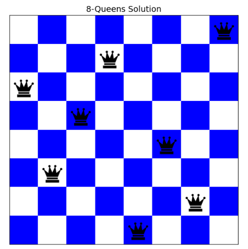
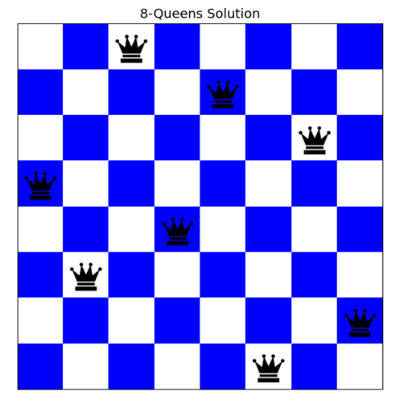

# ♟️ N-Queens Problem – Local Search Algorithms

This project solves the **N-Queens problem** using **Local Search algorithms** as part of an *Artificial Intelligence course project*.

The goal is to place **N queens** on an **N×N chessboard** such that **no two queens threaten each other** (no shared row, column, or diagonal).

---

## 📌 Implemented Algorithms

### 1️⃣ Hill Climbing

A simple local search algorithm that:

* Starts from a random initial state
* Iteratively moves to a better neighboring state
* Stops when no better neighbor exists

⚠️ **Important Limitation:**
Hill Climbing is **very prone to getting stuck in a Local Optimum**, meaning:

* The algorithm may stop even though the solution is **not valid**
* Conflicts between queens may still exist

📷 Example output (may be invalid due to local optimum):



---

### 2️⃣ Hill Climbing with Random Restart

An improved version of Hill Climbing:

* Runs Hill Climbing multiple times
* Each time starts from a **new random state**
* Keeps the best solution found

✅ This method **greatly reduces the chance of being stuck in local optima** and:

* For 8-Queens, it **almost always finds a valid solution (cost = 0)**

📷 Example valid output:



---

### 3️⃣ Simulated Annealing

A probabilistic local search algorithm inspired by physics:

* Sometimes accepts worse moves
* Helps escape local optima
* Uses a temperature parameter that gradually decreases

✅ With proper parameter tuning, it successfully finds valid solutions.

📷 Example valid output:



---

## 🎨 Visualization

* The chessboard is displayed in **black & white**
* Queens are drawn using a **PNG image**
* A solution is displayed **only if it is valid (cost = 0)**

---

## 📂 Project Structure

```text
n_queens_project/
│
├── main.py
├── nqueens.py
├── hill_climbing.py
├── random_restart.py
├── simulated_annealing.py
├── visualization.py
│
├── assets/
│   └── queen.png
│
├── images/
│   ├── hill_climbing.png
│   ├── random_restart.png
│   └── simulated_annealing.png
│
└── README.md
```

---

## ▶️ How to Run

```bash
python main.py
```

Then choose the desired algorithm:

* `1` Hill Climbing
* `2` Hill Climbing with Random Restart
* `3` Simulated Annealing

---

## 🧠 Key Takeaways

* Local search algorithms **do not guarantee optimal solutions**
* Hill Climbing often fails due to **local optima**
* Random Restart and Simulated Annealing significantly improve performance
* Only solutions with **zero conflicts (cost = 0)** are considered valid

---

## 🎓 Course Information

* Course: Artificial Intelligence
* Topic: Local Search Algorithms
* Problem: N-Queens
* Language: Python

---

## 👤 Author

**Parsa Zamani**

---
